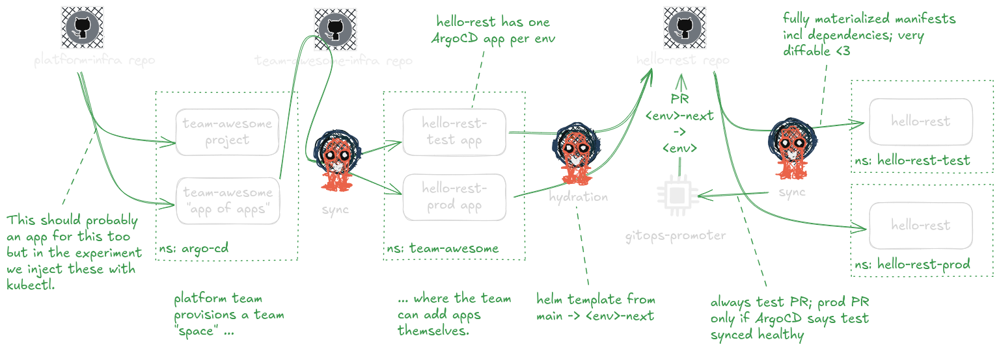

# Demonstrate Argo CD with environment promotion

This experiment demonstrates two somewhat unrelated features:

- self-service app installation with ArgoCD. A platform team empowers a dev team to bootstrap their own set of apps across multiple namespaces.
- environment promotion using environment branches. This explores the ArgoCD "hydration" concept in combination with [gitops-promoter](https://github.com/argoproj-labs/gitops-promoter) to have automatic pull request-based promotion of changes across environments.



Unlike other experiments, I decided it would be too much work to pull in my own SCM service (e.g. Forgejo) so you will have to modify this experiment to point to your own GitHub account or similar.

This experiment was performed with ArgoCD 8.1.2 which is the first version in which the hydration feature work when installing with the Helm chart. For more info, see [#3333](https://github.com/argoproj/argo-helm/issues/3333).

```shell
kind create cluster --config ./kind-cluster.yaml
kubectl apply -f https://raw.githubusercontent.com/kubernetes/ingress-nginx/main/deploy/static/provider/kind/deploy.yaml
```

## Setup Argo CD

```shell
helm upgrade --install \
  --namespace argo-cd --create-namespace \
  --values ./argocd-promotion/values-argocd.yaml \
  argo-cd \
  argo/argo-cd
kubectl --namespace argo-cd create secret generic bittrance-gitops-promoter \
  --from-literal=url=https://github.com/bittrance/kubernetes-experiments \
  --from-literal=type=git \
  --from-literal=githubAppID=1460251 \
  --from-literal=githubAppInstallationID=72971609 \
  --from-file=githubAppPrivateKey=./private-key.pem
kubectl --namespace argo-cd label \
  secret bittrance-gitops-promoter \
  argocd.argoproj.io/secret-type=repository-write
```

## Setup gitops-promoter

```shell
kubectl apply -f https://github.com/argoproj-labs/gitops-promoter/releases/download/v0.7.0/install.yaml
kubectl --namespace promoter-system create secret generic bittrance-gitops-promoter \
  --from-file=githubAppPrivateKey=./private-key.pem
```

I had to apply twice.

At this point, make sure your changes are pushed to SCM as this step will have ArgoCD start pulling from repo:

```yaml
kubectl apply -f ./argocd-promotion/platform-infra/team-awesome.yaml
```

At this point, the promoter-controller-manager fails with:
```json
{
  "controller": "changetransferpolicy",
  "controllerGroup": "promoter.argoproj.io",
  "controllerKind": "ChangeTransferPolicy",
  "ChangeTransferPolicy": {
    "name": "hello-rest-environment-prod-9cd7019e",
    "namespace": "team-awesome"
  },
  "namespace": "team-awesome",
  "name": "hello-rest-environment-prod-9cd7019e",
  "reconcileID": "fff61df4-0301-4d46-9573-a4b6a69d104f",
  "error": "failed to calculate ChangeTransferPolicy status: failed to get SHAs for proposed branch \"environment/prod-next\": exit status 128"
}
```

The problem can be addressed with a restart:

```shell
kubectl --namespace promoter-system rollout restart deployment promoter-controller-manager
```

References:

- [argoproj-labs/gitops-promoter#332](https://github.com/argoproj-labs/gitops-promoter/pull/332)
