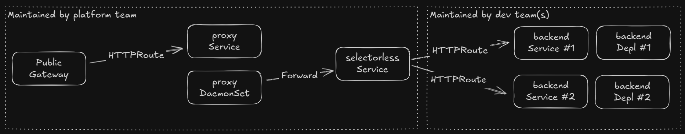

# Demonstrate waypoint proxy using Gateway API with Cilium

This experiment aims to set up a [waypoint proxy](https://istio.io/latest/docs/ambient/usage/waypoint/) using Gateway API resources. We use Cilium as CNI for this experiment. Part of the idea is that this setup makes sense when a platform team wants to apply "custom" logic that Gateway API cannot be expected to support, such as non-standard authentication or API budgets.



Tested with Kind 0.24.0 and Kubernetes 1.31.

```bash
kind create cluster --config ./gateway-api-cilium/kind-cluster-no-cni.yaml
docker run -d --rm --init --network kind -v /var/run/docker.sock:/var/run/docker.sock registry.k8s.io/cloud-provider-kind/cloud-controller-manager:v0.6.0
```

This experiment uses its own kind config in order to apply Cilium both as CNI and as kube-proxy replacement. The latter is not strictly necessary to run Gateway API, but removing kube-proxy is one of the compelling reasons to use Cilium, so this makes the experiment more realistic. Inspiration from https://medium.com/@charled.breteche/kind-cluster-with-cilium-and-no-kube-proxy-c6f4d84b5a9d.

At the point of testing this, Cilium has a defect that means it fails to "adopt" gateways unless the `TLSRoute` CRD is present. To work around this, we load the experimental CRDs for now.

```bash
kubectl apply -f https://github.com/kubernetes-sigs/gateway-api/releases/download/v1.2.1/experimental-install.yaml
```

We can now install Cilium. This takes a few minutes before everything is up and running. We also activate ALPN to get working HTTP/2 (and GRPC, though we do not test those in this experiment).

```bash
helm repo add cilium https://helm.cilium.io/
helm upgrade --install cilium cilium/cilium \
  --version 1.18.0.pre.0 \
  --namespace kube-system \
  --set image.pullPolicy=IfNotPresent \
  --set ipam.mode=kubernetes \
  --set gatewayAPI.enabled=true \
  --set gatewayAPI.enableAlpn=true \
  --set nodePort.enabled=true \
  --set kubeProxyReplacement=true \
  --set k8sServiceHost=kind-control-plane \
  --set k8sServicePort=6443
```

We can now add an "interconnect" and a consuming backend:

```bash
kubectl apply -f ./gateway-api-cilium/gateway-api-interconnect.yaml
kubectl apply -f ./gateway-api-cilium/hello-backend.yaml
```

This setup works if the waypoint gateway is a normal public gateway, but fails if the gateway uses the `cilium-internal` gateway. Reported in https://github.com/cilium/cilium/issues/38852. This may be a bug in Cilium, but more generally, Gateway API has not yet standardized such support, see https://github.com/kubernetes-sigs/gateway-api/pull/3608.
